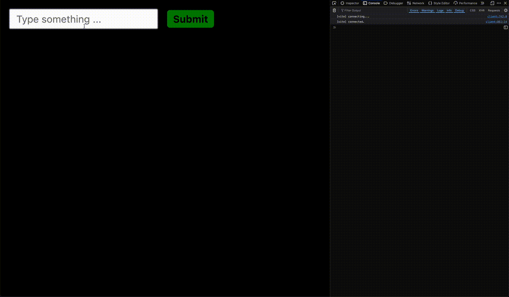

# Frontend Practice

Create a vanilla TypeScript project using Vite

- Initialize project: `npm init vite@latest`
- Enter project name
- For framework select `Vanilla`
- For variant select `TypeScript`

IMPORTANT: Do not install any additional dependencies.

## Task 1

Draw a red rectangle in the middle of the screen. When you click on the rectangle it should change color to green. If you click again, it should change color to blue and if you click again, it should switch back to red. This means that clicking on the rectangle it should loop through red, green and blue colors.

Rectangle should stay in the middle of the screen event if the window is resized.

## Task 2

Draw a rectangle with starting position in the middle of the screen and when you click on it, it should move to a random location on the screen.

Additional, when resizing a window, rectangle should stay on the screen.

## Task 3

Draw a circle which will follow users mouse on the screen. Circle shouldn't instantly jump to the cursor but it should slowly approach it.

## Task 4

Create a text input and when you type inside of it, typed text should also appear bellow the input inside the `p` tag.

## Task 5

Create a text input and submit button. When submit button is clicked, toast notification should appear on the left bottom side of the screen with animation (see GIF bellow) and content of the text input. If the toast is clicked, it should disappear, and if it is not clicked, it should disappear after 5 seconds.

